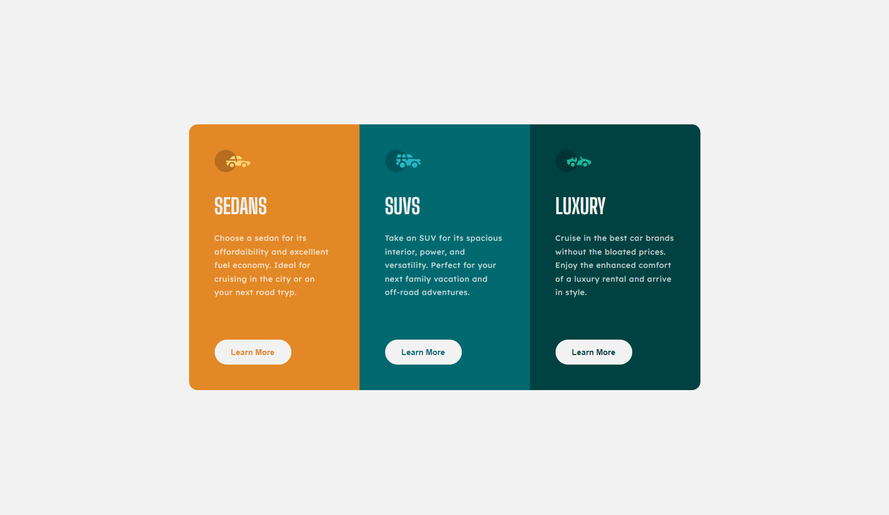

# Frontend Mentor - 3-column preview card component solution

This is a solution to the [3-column preview card component challenge on Frontend Mentor](https://www.frontendmentor.io/challenges/3column-preview-card-component-pH92eAR2-). Frontend Mentor challenges help you improve your coding skills by building realistic projects. 

## Table of contents

- [Overview](#overview)
  - [Screenshot](#screenshot)
  - [Links](#links)
- [My process](#my-process)
  - [Built with](#built-with)
  - [What I learned](#what-i-learned)
  - [Continued development](#continued-development)
  - [Useful resources](#useful-resources)
- [Author](#author)

## Overview

This challenge involves making a preview card component having 3 columns inside. All
of the 3 columns have the exact same structure, with just different logos and text.
The cards are horizontally aligned when viewed in desktop mode, but in mobile mode
are vertically aligned. 

### Screenshot

### Links

- Solution URL: [Solution](https://www.frontendmentor.io/solutions/responsive-3column-preview-card-component-qUHQ8MyEyk)
- Live Site URL: [Live site](https://mehrasourav-3-column-preview-card-component.netlify.app/)

## My process

I started with first applying what I learned from the last challenge. I applied CSS resets, imported globally the colors, fonts, etc.

Next I thought about the component structure. 

Once the structure was in place, I started with putting in whatever needed to be shown, the image, the header, the description.

Next I styled them as close as possible to the design, like the colors, the size, the font, the border-radius, etc.

At the end I placed the button and styled it. 

Testing the component on the mobile layout, made me recall 1 feedback point from my last challenge, I should let the content of the container decide it's height and not hard code the height, and width for that matter. So I applied this feedback, and got the results I wanted.

### Built with

- Semantic HTML5 markup
- CSS custom properties
- Flexbox
- [VueJS](https://vuejs.org/) - JS Framework
- SASS
- Mobile-first workflow

### What I learned

This was one of my first attempts to code something on my own with Vue, eventhough I have ~2 years of experience in it.

1. It's good to plan your application's structure before starting to code.

2. You'll always need to go back to the documentation once in a while, no matter how long you've been working with somtething, and you shouldn't be embarrassed to do so.

3. Seemingly simple concepts might seem hard when you're going through it for the first time, but it won't always remain so. So start learning and understanding them and you'll see the hard things become simple before you.

4. Don't underestimate consistency. I could have done this challenge a lot sooner only if I'd been more consistent. I relied on my extra motivation during weekends to complete everything related to this challenge, which costed me ~1 extra week. The actual coding part was done in just 1 day (the previous Sunday). I can cover more ground, if I stay more consistent.

### Continued development

- I tried using BEM syntax in this challenge eventhough I'm not fully confident with it. I will continue applying this in future challenges for practice. I could look into BEM alternatives once I get more comfortable with this.
- Eventhough, I've worked with Vue, I'm still not confident in it. I need to start more and more projects from scratch using Vue. I could look into React once I get more confident with Vue.

### Useful resources

- [VueJS - Class and Style Bindings](https://vuejs.org/guide/essentials/class-and-style.html) - This helped me recall how to use JS objects for applying styles to elements/components.
- [PX to REM converter](https://nekocalc.com/px-to-rem-converter) - This is small and quick tool to convert px values to rem or vice versa.

## Author

- Frontend Mentor - [@mehra-sourav](https://www.frontendmentor.io/profile/mehra-sourav)
- Twitter - [@Souravmehra](https://www.twitter.com/Souravmehra)
